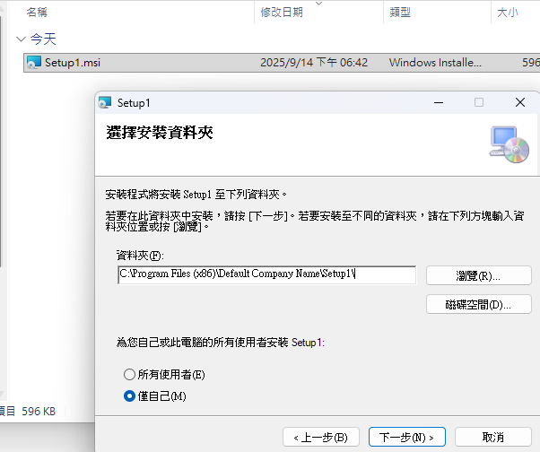
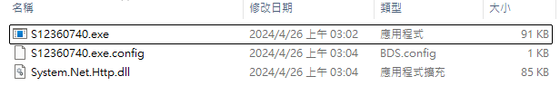
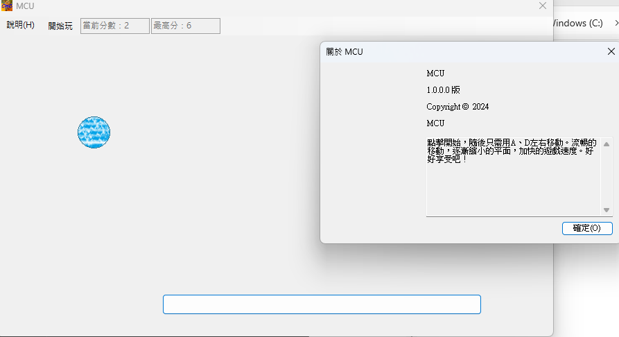
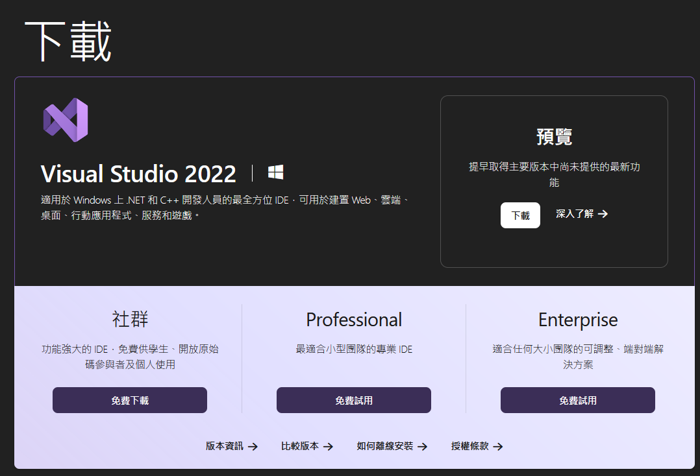
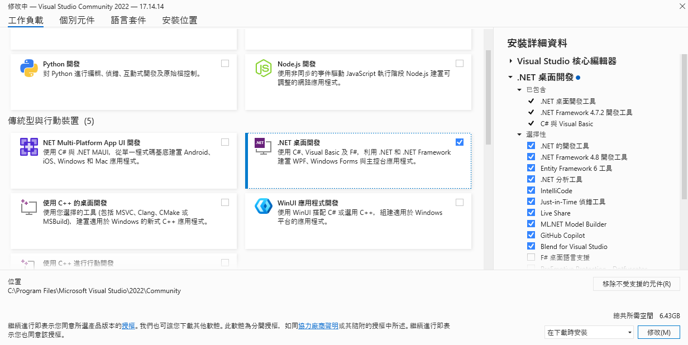
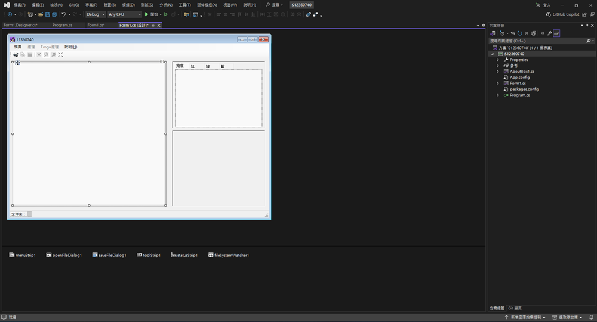

# C--window_game
用 VScode社群版 搭配 C# 製作win介面
包含 反彈球遊戲 及 影像處理

## 1.安裝執行檔 
只需下載並執行 [執行檔/Setup1.msi] 即可
安裝後執行並選取要安裝到的位置:

## 2.簡易遊戲
最後呈現出來的就是一個簡單的小遊戲

## 3.程式編輯
如果想要自己去做這種遊戲，可以安裝 VScode社群版 來編輯專案。

記得要增加模組進去。

最後就可以進入頁面操作了。

